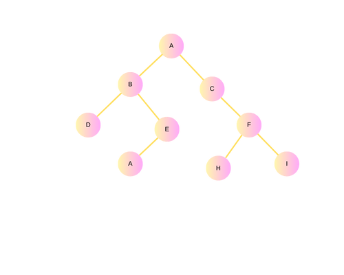
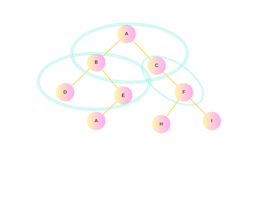
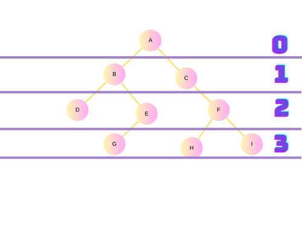
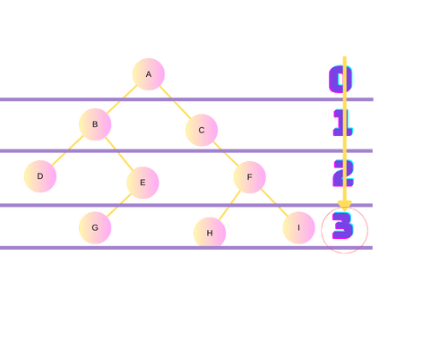
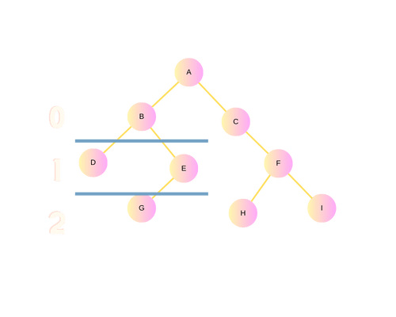
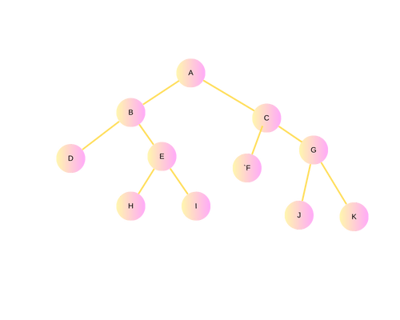
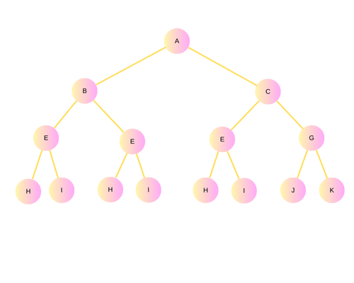

# Anotações Importantes | Estruturas de Dados I

Cada arquivo dessa aula será referente à uma aula prática, então esse projeto tem por objetivo ser um diário de estudos e não um projeto real.

Para executar a linguagem C no VC, você pode utilizar um compilador fora do editor (o mingw), o que será um tanto trabalhoso, e  as extensões do VC para a linguagem C, entretanto, você pode executar facilmente <a href="https://replit.com/">aqui</a>, que é a ferremanta que eu uso, é só se cadastrar e na página principal clicar em Create Repl, depois você pode copiar o código de cada arquivo aqui e colar ali.

*OBS: Em C dependendo da ferramenta, não é possível, ou pelo menos ainda não encontrei informações sobre, utilizar acentuações atravéz da configuração UTF-8 para caracteres especiais contidos na  lingua portuguesa*

Fontes: Universidade Unicesumar e Livro Estruturas de Dados I, Estruturas de Dados II.

## Sobre a Linguagem | Relembrando alguns Conceitos:

Para gerar números aleatório dentro de um array, podemos usar a função rand();
Para que a função rand sempre gere números diferentes, podemos usar o srand, pssando como parâmetro o horário (que sempre será diferente)

Ex:


## Ponteiros

Ex1:


Ex2:


*Obs:. A função imprimir só conseguiu alterar o endereço porque recebeu o endereço e não a variável*


## sizeof()

Retorna o tamnanho em bits


Retorno:


## Vetor

O vetor já é uma ponteiro!
*OBS:. Cuidado ao guardar informações no vetor sem a alocação da memória, ele até aceita, porém pode ser sobreposto por outros programas*

EX:


Quando você quiser descobrir a quantidade de elementos de um vetor:


## Malloc
A função malloc aloca um espaço de memória e retorna um ponteiro do tipo void para o início do espaço de memória alocado.

### Sintaxe

````
<ponteiro> = (<cast>*) malloc(<tamanho em bytes>); 
p = (int*) malloc(4);
````


## Free
A função free libera o espaço de memória alocado.

## Criando Vetores Dinamicos

O objetivo desses vetores é usar somente a quantidade de memória que for precisar, aqui ao contrário dos vetores de tamanho fixo, não ficamos limitados ao tamanho.

Como utilizar:

````
#include <stdio.h>
#include <stdlib.h>
#include <math.h>

int main() {
    int tam;
    int *vetor;

    printf ("Escolha o tamanho do vetor: ");
    scanf("%d", &tam);

    vetor = (int *) malloc(sizeof (int)*tam);
    for (int i = 0; i < tam; i++) {
        vetor[i] = pow(2,i);
        printf ("Posicao %d: %d\n", i, vetor[i]);
    }
    system("Pause");
    return(0);
}
````
### Sizeof

O operador sizeof indica a quantidade de armazenamento, em bytes, necessária para armazenar um objeto do tipo do operando.

Como saber o tamanho do vetor?


## Listas

### Listas Simplesmente Encadeadas


### Listas Duplamente Encadeadas


### Listas 


### Pilha || Stack

<div align="center">
    
</div>


Pilha ou stack é uma lista linear em que todas as inserções e remoções de elemento só podem ser feitos em uma extremidade chamada topo.As pilhas também são chamadas de estruturas LIFO (Last In First Out) ou seja o último elemento inserido é o primeiro removido.

**Push** Empilhar | **Pop** Desempilhar

**Estrutura de Dados da Pilha**

````
struct tipo_pilha {
    int dados [tamanho];
    int inicio;
    int topo;
}
````

### Fila

<div align="center">
    
</div>


Este tipo de estrutura de dados é dita ser FIFO (First in, first out), ou seja, o primeiro elemento a entrar na estrutura é o primeiro a sair. O nome fila, por si só, já é auto-explicativo. Imagine uma fila de banco. A primeira pessoa que chegou na fila, é a que vai ser atendida primeiro.

**Estrutura de Dados da Fila**

````
struct tipo_pilha {
    int dados [tamanho];
    int inicio;
    int fim;
}
````

# Anotações Importantes | Estruturas de Dados Dois

## Arvores Binárias

<div align="center">
    
</div>

Uma árvore binária é uma estrutura de dados que pode ser representada como uma hierarquia onde cada elemento é chamado de nó. O nó inicial ou o primeiro elemento é chamado de raiz.

*Só existe um caminho de um nó ao outro*

**Definição:** Conjunto finito de elementos T = { R, E, D}

- No exemplo acima há três subconjuntos distintos:
- Raiz (R);
- Subárvore binária esquerda (E);
- Subárvore binária direita (D).

- Pode ser vazio, T = 0.

Exemplo:     

T.a = { R.a, E.a, D.a }

R.a = {A}

E.a = T.b

D.a = T.c

<div align="center">
    
    
</div>

Nesse exemplo A é pai de B e C, da mesma maneira C e B é filho de A. Um nó sem filho é um nó folha.

Os nós acima são nós **ancestrais** e abaixo **descendente**.

### Nível

<div align="center">
    
</div>

### Altura

<div align="center">
    
</div>

*Obs: Qual a altura de B?*

<div align="center">
    
</div>

## Arvores Estritamente Binárias

<div align="center">
    
</div>

Árvore estritamente binária: Cada nó possui exatamente 0 ou 2 filhos. Árvore binária completa: Nós com menos de 2 filhos ficam no úlimo ou no penúltimo nível da árvore. Árvore binária cheia: Nós com menos de 2 filhos ficam no último nível da árvore.

``n° de nós = (2*folhas) -1``

Seguindo o exemplo: Nós = (6 * 2) -1   =>   Nós = 11.

## Arvores Binárias Completa

<div align="center">
    
</div>

Árvore binária completa : em uma árvore binária completa todos os níveis, exceto possivelmente o último , está completamente cheia, e todos os nós no último nível são, tanto à esquerda quanto possível. Assim fica claro entender o termo, "tanto à esquerda quanto possível". Caso contrário, os nós vão se sobrepôr.

*Obs: Uma árvore binária completa também é uma árvore estritamente binária, porém uma árvore binária não é, necessariamente, uma árvore binária completa!*


## Implementação de Árvores Binárias

**Estática:** Sem registros e com registros;
**Dinâmicas:** Utiliza registros com ponteiros.

### Busca em árvores Binárias

- Árvore binária ordenada;
- Árvore balanceada.
